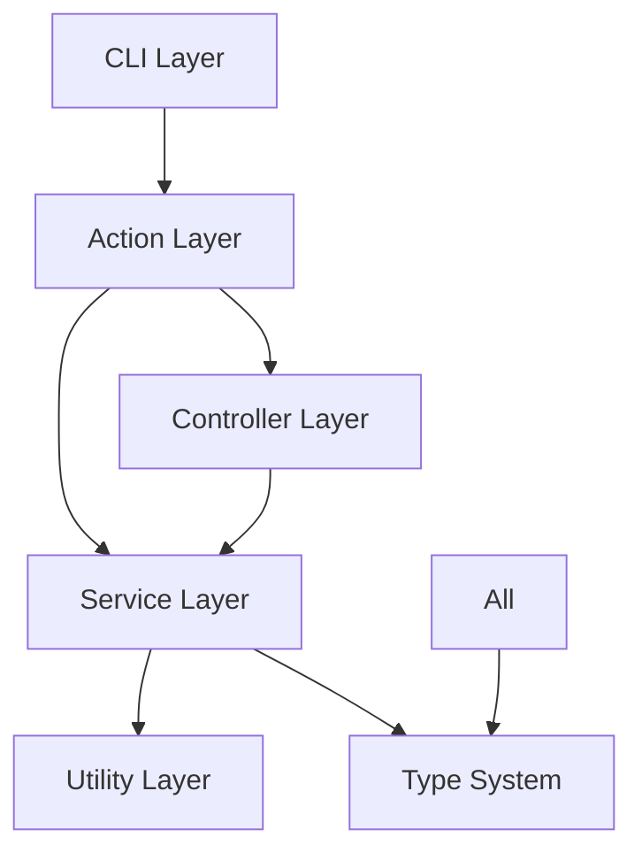

# Claude Stacks - Developer Handbook

## Table of Contents

1. [Getting Started](#getting-started)
2. [Development Environment Setup](#development-environment-setup)
3. [Project Structure](#project-structure)
4. [Development Workflow](#development-workflow)
5. [Code Standards](#code-standards)
6. [Testing Guidelines](#testing-guidelines)
7. [Debugging and Troubleshooting](#debugging-and-troubleshooting)
8. [Contributing Guidelines](#contributing-guidelines)
9. [Release Process](#release-process)
10. [Best Practices](#best-practices)

---

## Getting Started

### Prerequisites

- **Node.js**: Version 18.0.0 or higher
- **npm**: Version 8.0.0 or higher
- **Git**: Version 2.28.0 or higher
- **Claude Code**: Latest version installed and configured

### Quick Setup

```bash
# Clone the repository
git clone https://github.com/commands-com/claude-stacks.git
cd claude-stacks

# Install dependencies
npm install

# Build the project
npm run build

# Run tests to verify setup
npm test

# Install globally for development
npm link

# Verify installation
claude-stacks --version
```

### Project Overview

Claude Stacks is a TypeScript CLI tool built with:

- **TypeScript 5.3+**: Strict type checking and modern language features
- **Node.js ESM**: Modern module system with `.js` import extensions
- **Commander.js**: Robust CLI framework with help generation
- **Jest**: Comprehensive testing framework with coverage reporting
- **ESLint + Prettier**: Code quality and formatting tools

---

## Development Environment Setup

### IDE Configuration

#### Visual Studio Code

Recommended extensions:

```json
{
  "recommendations": [
    "ms-vscode.vscode-typescript-next",
    "esbenp.prettier-vscode",
    "ms-vscode.vscode-eslint",
    "ms-vscode.test-adapter-converter",
    "hbenl.vscode-test-explorer",
    "bradlc.vscode-tailwindcss",
    "ms-vscode.vscode-json"
  ]
}
```

VSCode settings (`.vscode/settings.json`):

```json
{
  "typescript.preferences.includePackageJsonAutoImports": "on",
  "typescript.suggest.autoImports": true,
  "editor.formatOnSave": true,
  "editor.codeActionsOnSave": {
    "source.fixAll.eslint": true,
    "source.organizeImports": true
  },
  "files.associations": {
    "*.json": "jsonc"
  },
  "jest.jestCommandLine": "npm test --",
  "jest.autoRun": "watch"
}
```

#### Environment Variables

Create `.env.local` for development configuration:

```bash
# Development API endpoint
CLAUDE_STACKS_DEV=true

# Debug logging
DEBUG=claude-stacks:*
NODE_ENV=development

# OAuth configuration (development)
OAUTH_CLIENT_ID=claude-stacks-dev
OAUTH_REDIRECT_PORT=8080

# Test configuration
JEST_COVERAGE=true
TEST_TIMEOUT=30000
```

### TypeScript Configuration

The project uses strict TypeScript configuration:

**`tsconfig.json`** - Production build:

```json
{
  "compilerOptions": {
    "target": "ES2020",
    "module": "ESNext",
    "moduleResolution": "Node",
    "esModuleInterop": true,
    "allowSyntheticDefaultImports": true,
    "strict": true,
    "noUncheckedIndexedAccess": true,
    "exactOptionalPropertyTypes": true,
    "noImplicitReturns": true,
    "noFallthroughCasesInSwitch": true,
    "noImplicitOverride": true,
    "declaration": true,
    "outDir": "./dist",
    "rootDir": "./src"
  },
  "include": ["src/**/*"],
  "exclude": ["tests/**/*", "dist/**/*"]
}
```

**`tsconfig.test.json`** - Test configuration:

```json
{
  "extends": "./tsconfig.json",
  "compilerOptions": {
    "types": ["jest", "node", "@types/jest"],
    "noEmit": true
  },
  "include": ["src/**/*", "tests/**/*"],
  "exclude": ["dist/**/*"]
}
```

### ESM Module Configuration

The project uses ESM modules exclusively:

**Import Patterns:**

```typescript
// ✅ Correct - Use .js extensions
import { StackService } from './services/StackService.js';
import type { DeveloperStack } from './types/index.js';

// ❌ Incorrect - Missing file extension
import { StackService } from './services/StackService';

// ✅ Correct - Dynamic imports
const { colors } = await import('./utils/colors.js');

// ✅ Correct - JSON imports
import packageJson from '../package.json' assert { type: 'json' };
```

**package.json Configuration:**

```json
{
  "type": "module",
  "main": "./dist/cli.js",
  "bin": {
    "claude-stacks": "./dist/cli.js"
  },
  "exports": {
    ".": "./dist/cli.js",
    "./types": "./dist/types/index.js",
    "./services": "./dist/services/index.js"
  }
}
```

---

## Project Structure

### Source Code Organization

```
src/
├── cli.ts                      # CLI entry point and command definitions
├── actions/                    # Command implementations
│   ├── BaseAction.ts           # Base class with common functionality
│   ├── export.ts               # Export command logic
│   ├── install.ts              # Install command logic
│   ├── publish.ts              # Publish command logic
│   └── ...                     # Other command actions
├── services/                   # Business logic services
│   ├── index.ts                # Service exports
│   ├── ConfigService.ts        # Configuration management
│   ├── StackService.ts         # Stack CRUD operations
│   ├── ApiService.ts           # Marketplace API client
│   └── ...                     # Other services
├── controllers/                # Request orchestration
│   └── StackController.ts      # Primary stack controller
├── types/                      # TypeScript type definitions
│   ├── index.ts                # Main type exports
│   ├── stack.ts                # Stack-related types
│   ├── api.ts                  # API request/response types
│   └── ...                     # Other type definitions
├── utils/                      # Cross-cutting utilities
│   ├── colors.ts               # Terminal color utilities
│   ├── auth.ts                 # Authentication helpers
│   ├── validators.ts           # Input validation
│   └── ...                     # Other utilities
├── constants/                  # Application constants
│   └── paths.ts                # File path constants
├── config/                     # Configuration files
│   └── dependency-mappings.json # Dependency resolution rules
└── ui/                         # User interface components
    ├── display.ts              # Display formatting
    └── menus.ts                # Interactive menus
```

### Architectural Layers

#### 1. CLI Layer (`cli.ts`)

- Command parsing and validation
- Help text generation
- Error handling and user feedback
- Delegates to action layer for business logic

#### 2. Action Layer (`actions/`)

- Implements business logic for each command
- Coordinates between services
- Handles user interaction and feedback
- Manages command-specific workflow

#### 3. Service Layer (`services/`)

- Core business logic implementation
- Data access and manipulation
- External API integration
- Reusable functionality across actions

#### 4. Controller Layer (`controllers/`)

- Orchestrates complex service interactions
- Provides consistent error handling
- Manages transaction-like operations
- Abstracts service complexity from actions

#### 5. Utility Layer (`utils/`)

- Cross-cutting concerns
- Helper functions and utilities
- Shared functionality
- Pure functions without side effects

### Dependency Flow



---

## Development Workflow

### Branch Strategy

We use a simplified Git flow:

```
main
├── feature/new-feature-name
├── bugfix/issue-description
├── hotfix/critical-fix
└── release/version-number
```

**Branch Naming:**

- `feature/` - New features or enhancements
- `bugfix/` - Bug fixes for existing issues
- `hotfix/` - Critical fixes for production issues
- `release/` - Release preparation and versioning
- `docs/` - Documentation-only changes

### Development Process

#### 1. Create Feature Branch

```bash
# Update main branch
git checkout main
git pull origin main

# Create feature branch
git checkout -b feature/hook-security-scanner

# Push branch to remote
git push -u origin feature/hook-security-scanner
```

#### 2. Development Cycle

```bash
# Make changes
# ... edit files ...

# Run quality checks
npm run quality

# Run tests
npm test

# Build project
npm run build

# Test CLI functionality
./dist/cli.js export --help
```

#### 3. Commit Standards

We follow [Conventional Commits](https://www.conventionalcommits.org/):

```bash
# Feature commits
git commit -m "feat: add hook security scanning functionality"
git commit -m "feat(api): implement stack publishing with OAuth"

# Bug fix commits
git commit -m "fix: resolve path traversal vulnerability in file service"
git commit -m "fix(cli): handle missing config file gracefully"

# Documentation commits
git commit -m "docs: add comprehensive API documentation"
git commit -m "docs(readme): update installation instructions"

# Refactor commits
git commit -m "refactor: extract authentication logic to service"
git commit -m "refactor(types): improve type safety with branded types"

# Test commits
git commit -m "test: add integration tests for stack installation"
git commit -m "test(unit): improve coverage for ConfigService"
```

#### 4. Code Review Process

Before submitting PR:

```bash
# Run full quality check
npm run quality

# Run full test suite
npm run test:coverage

# Check build
npm run build

# Test installation
npm pack
npm install -g ./claude-stacks-*.tgz
claude-stacks --version
```

#### 5. Pull Request Guidelines

**PR Title Format:**

```
<type>(<scope>): <description>

Examples:
feat(hooks): add security scanning for user hooks
fix(auth): resolve OAuth token refresh issue
docs(api): add comprehensive service documentation
```

**PR Description Template:**

```markdown
## Summary

Brief description of changes and why they were made.

## Changes Made

- [ ] Added new feature X
- [ ] Fixed bug Y
- [ ] Updated documentation Z

## Testing

- [ ] Unit tests added/updated
- [ ] Integration tests pass
- [ ] Manual testing completed
- [ ] Edge cases considered

## Breaking Changes

- None / List any breaking changes

## Additional Notes

Any additional context or considerations.
```

### Development Scripts

#### Primary Scripts

```bash
# Development
npm run dev              # Start development with tsx
npm run build            # Build TypeScript to dist/
npm run watch            # Watch mode compilation

# Code Quality
npm run lint             # Run ESLint
npm run lint:fix         # Fix auto-fixable ESLint issues
npm run format           # Run Prettier formatting
npm run format:check     # Check Prettier formatting
npm run typecheck        # Run TypeScript type checking
npm run quality          # Run all quality checks
npm run quality:fix      # Run all quality fixes

# Testing
npm test                 # Run all tests with coverage
npm run test:watch       # Run tests in watch mode
npm run test:unit        # Run unit tests only
npm run test:integration # Run integration tests only
npm run test:e2e         # Run end-to-end tests
npm run test:coverage    # Generate detailed coverage report
npm run test:debug       # Run tests with debugger
```

#### Specialized Scripts

```bash
# Testing Variations
npm run test:ci          # CI-optimized test run
npm run test:clear       # Clear Jest cache
npm run test:update-snapshots # Update test snapshots
npm run coverage:open    # Open coverage report in browser

# Development Tools
npm run prepublishOnly   # Pre-publish quality checks
npm run prepare          # Husky git hooks setup
```

---

## Code Standards

### TypeScript Guidelines

#### Type Definitions

**Use strict typing:**

```typescript
// ✅ Good - Explicit types
interface StackCommand {
  readonly name: string;
  readonly filePath: string;
  readonly content: string;
  readonly description?: string;
}

// ❌ Avoid - Any types
function processStack(stack: any): any {
  return stack;
}

// ✅ Good - Generic constraints
function processStack<T extends DeveloperStack>(stack: T): T {
  return stack;
}
```

**Use branded types for domain concepts:**

```typescript
// ✅ Good - Branded types prevent confusion
type StackName = Brand<string, 'StackName'>;
type StackVersion = Brand<string, 'StackVersion'>;

function getStack(name: StackName, version: StackVersion): Stack {
  // Implementation
}

// ❌ Avoid - Primitive obsession
function getStack(name: string, version: string): Stack {
  // Could accidentally swap parameters
}
```

**Use Result pattern for error handling:**

```typescript
// ✅ Good - Explicit error handling
async function loadStack(name: string): Promise<Result<Stack, StackError>> {
  try {
    const stack = await readStackFile(name);
    return { success: true, data: stack };
  } catch (error) {
    return { success: false, error: new StackError('Load failed', error) };
  }
}

// Usage
const result = await loadStack('my-stack');
if (result.success) {
  console.log(result.data.name);
} else {
  console.error(result.error.message);
}
```

#### Code Organization

**Module Structure:**

```typescript
// File: src/services/StackService.ts

// 1. Imports (external first, then internal)
import { readFile } from 'fs/promises';
import { join } from 'path';

import type { DeveloperStack, StackError } from '../types/index.js';
import { FileService } from './FileService.js';
import { validateStack } from '../utils/validators.js';

// 2. Types and interfaces (if not in separate file)
interface StackServiceOptions {
  readonly baseDir: string;
  readonly createBackups: boolean;
}

// 3. Class definition
export class StackService {
  constructor(
    private readonly fileService: FileService,
    private readonly options: StackServiceOptions = {
      baseDir: '~/.claude/stacks',
      createBackups: true,
    }
  ) {}

  // 4. Public methods first
  async createStack(args: CreateStackArgs): Promise<Result<DeveloperStack, StackError>> {
    // Implementation
  }

  // 5. Private methods last
  private validateStackName(name: string): boolean {
    // Implementation
  }
}
```

**Function Guidelines:**

```typescript
// ✅ Good - Pure functions when possible
function calculateStackMetadata(stack: DeveloperStack): StackMetadata {
  return {
    componentCount: (stack.commands?.length || 0) + (stack.agents?.length || 0),
    lastModified: new Date().toISOString(),
    checksum: generateChecksum(stack)
  };
}

// ✅ Good - Clear parameter types and return types
async function mergeConfigurations(
  base: ClaudeConfig,
  overlay: ClaudeConfig
): Promise<ClaudeConfig> {
  // Implementation
}

// ✅ Good - Use readonly for immutable data
function processStackData(
  readonly stack: DeveloperStack
): readonly ProcessedCommand[] {
  // Implementation that doesn't mutate input
}
```

### Naming Conventions

#### Files and Directories

- **PascalCase** for classes: `StackService.ts`, `ApiService.ts`
- **camelCase** for functions and variables: `exportAction.ts`, `colors.ts`
- **kebab-case** for CLI commands and directories: `scan-hooks`, `list-stacks`

#### Variables and Functions

```typescript
// ✅ Good naming
const isAuthenticated = await checkAuthentication();
const publishedStack = await publishToMarketplace(stack);
const userConfirmation = await promptUser('Continue?');

// Service methods - verb + noun
async function createStack(args: CreateStackArgs): Promise<Stack>;
async function deleteStack(stackId: string): Promise<void>;
async function validateStackSchema(stack: unknown): Promise<ValidationResult>;

// Boolean functions/variables - is/has/can/should prefix
function isValidStackName(name: string): boolean;
function hasRequiredPermissions(path: string): boolean;
function canOverwriteFile(filePath: string): boolean;
function shouldCreateBackup(options: BackupOptions): boolean;
```

#### Constants

```typescript
// ✅ Good - Descriptive constants
const MAX_STACK_SIZE = 100 * 1024 * 1024; // 100MB
const DEFAULT_TIMEOUT = 30_000; // 30 seconds
const STACK_FILE_EXTENSION = '.json';
const CLAUDE_CONFIG_FILENAME = 'claude_desktop_config.json';

// ✅ Good - Grouped constants
const HTTP_STATUS = {
  OK: 200,
  CREATED: 201,
  BAD_REQUEST: 400,
  UNAUTHORIZED: 401,
  NOT_FOUND: 404,
  INTERNAL_ERROR: 500,
} as const;

const ERROR_CODES = {
  STACK_NOT_FOUND: 'STACK_NOT_FOUND',
  VALIDATION_ERROR: 'VALIDATION_ERROR',
  NETWORK_ERROR: 'NETWORK_ERROR',
} as const;
```

### Error Handling Standards

#### Error Types

```typescript
// ✅ Good - Structured error classes
export class StackError extends Error {
  constructor(
    message: string,
    public readonly code: StackErrorCode,
    public readonly details?: unknown
  ) {
    super(message);
    this.name = 'StackError';
  }
}

// ✅ Good - Error code enums
export const STACK_ERROR_CODES = {
  NOT_FOUND: 'STACK_NOT_FOUND',
  ALREADY_EXISTS: 'STACK_ALREADY_EXISTS',
  VALIDATION_ERROR: 'VALIDATION_ERROR',
  FILESYSTEM_ERROR: 'FILESYSTEM_ERROR',
} as const;

export type StackErrorCode = (typeof STACK_ERROR_CODES)[keyof typeof STACK_ERROR_CODES];
```

#### Error Handling Patterns

```typescript
// ✅ Good - Result pattern with detailed errors
async function loadStackFile(filePath: string): Promise<Result<DeveloperStack, StackError>> {
  try {
    const content = await readFile(filePath, 'utf8');
    const stack = JSON.parse(content);

    const validation = validateStack(stack);
    if (!validation.success) {
      return failure(
        new StackError(
          'Invalid stack format',
          STACK_ERROR_CODES.VALIDATION_ERROR,
          validation.errors
        )
      );
    }

    return success(validation.data);
  } catch (error) {
    if (error.code === 'ENOENT') {
      return failure(
        new StackError(`Stack file not found: ${filePath}`, STACK_ERROR_CODES.NOT_FOUND)
      );
    }

    return failure(
      new StackError('Failed to load stack file', STACK_ERROR_CODES.FILESYSTEM_ERROR, error)
    );
  }
}

// ✅ Good - Error propagation
async function processStack(stackName: string): Promise<Result<ProcessedStack, StackError>> {
  const loadResult = await loadStackFile(stackName);
  if (!loadResult.success) {
    return loadResult; // Propagate error
  }

  // Continue processing...
}
```

### Async/Await Guidelines

```typescript
// ✅ Good - Consistent async patterns
async function publishStack(stack: DeveloperStack): Promise<Result<PublishedStack, ApiError>> {
  const authResult = await ensureAuthenticated();
  if (!authResult.success) {
    return failure(authResult.error);
  }

  const uploadResult = await uploadToMarketplace(stack, authResult.data.token);
  if (!uploadResult.success) {
    return failure(uploadResult.error);
  }

  return success(uploadResult.data);
}

// ✅ Good - Parallel execution when possible
async function loadMultipleStacks(stackIds: string[]): Promise<Result<Stack[], StackError>> {
  const loadPromises = stackIds.map(id => loadStack(id));
  const results = await Promise.allSettled(loadPromises);

  const stacks: Stack[] = [];
  const errors: StackError[] = [];

  for (const result of results) {
    if (result.status === 'fulfilled' && result.value.success) {
      stacks.push(result.value.data);
    } else if (result.status === 'fulfilled') {
      errors.push(result.value.error);
    } else {
      errors.push(new StackError('Unexpected error', 'UNKNOWN_ERROR', result.reason));
    }
  }

  return errors.length === 0 ? success(stacks) : failure(errors[0]);
}

// ❌ Avoid - Nested promises
function badAsyncExample(): Promise<Result<Data, Error>> {
  return loadData().then(result => {
    if (result.success) {
      return processData(result.data).then(processed => {
        return success(processed);
      });
    }
    return failure(result.error);
  });
}
```

---

## Testing Guidelines

### Test Structure

#### Test File Organization

```
tests/
├── unit/                       # Unit tests
│   ├── actions/                # Action unit tests
│   ├── services/              # Service unit tests
│   ├── utils/                 # Utility unit tests
│   └── types/                 # Type validation tests
├── integration/               # Integration tests
│   ├── api/                   # API integration tests
│   ├── filesystem/            # File system integration tests
│   └── workflows/             # End-to-end workflow tests
├── e2e/                       # End-to-end tests
│   ├── cli/                   # CLI command tests
│   └── scenarios/             # User scenario tests
├── performance/               # Performance tests
│   ├── benchmarks/            # Benchmark tests
│   └── stress/                # Stress tests
└── fixtures/                  # Test data and fixtures
    ├── stacks/                # Sample stack files
    ├── configs/               # Sample configurations
    └── mocks/                 # Mock data
```

#### Test Naming Convention

```typescript
// File naming: *.test.ts or *.spec.ts
// src/services/StackService.ts -> tests/unit/services/StackService.test.ts

describe('StackService', () => {
  describe('createStack()', () => {
    it('should create a new stack with valid input', () => {});
    it('should reject stack with invalid name format', () => {});
    it('should handle filesystem errors gracefully', () => {});
  });

  describe('loadStack()', () => {
    it('should load existing stack successfully', () => {});
    it('should return error for non-existent stack', () => {});
  });
});

// Test function naming patterns:
// should + expected behavior
// when + condition + should + expected behavior
// given + state + when + action + then + outcome
```

### Unit Testing

#### Test Setup Pattern

```typescript
import { jest, describe, it, expect, beforeEach, afterEach } from '@jest/globals';
import { StackService } from '../../../src/services/StackService.js';
import type { FileService, ConfigService } from '../../../src/services/index.js';

// Mock dependencies
const mockFileService = {
  readFile: jest.fn(),
  writeFile: jest.fn(),
  exists: jest.fn(),
  ensureDir: jest.fn(),
} as jest.Mocked<FileService>;

const mockConfigService = {
  readLocalConfig: jest.fn(),
  writeLocalConfig: jest.fn(),
  mergeConfigs: jest.fn(),
} as jest.Mocked<ConfigService>;

describe('StackService', () => {
  let stackService: StackService;

  beforeEach(() => {
    // Reset all mocks
    jest.clearAllMocks();

    // Create fresh service instance
    stackService = new StackService(mockFileService, mockConfigService);

    // Setup default mock behaviors
    mockFileService.exists.mockResolvedValue(false);
    mockFileService.ensureDir.mockResolvedValue({ success: true, data: undefined });
  });

  afterEach(() => {
    // Clean up any test state
    jest.restoreAllMocks();
  });

  describe('createStack()', () => {
    const validCreateArgs = {
      name: 'test-stack',
      description: 'Test stack description',
      version: '1.0.0',
      commands: [
        {
          name: 'test-command',
          filePath: 'commands/test.ts',
          content: 'export default function test() {}',
        },
      ],
    };

    it('should create a new stack with valid input', async () => {
      // Arrange
      mockFileService.writeFile.mockResolvedValue({ success: true, data: undefined });

      // Act
      const result = await stackService.createStack(validCreateArgs);

      // Assert
      expect(result.success).toBe(true);
      if (result.success) {
        expect(result.data.name).toBe('test-stack');
        expect(result.data.description).toBe('Test stack description');
        expect(result.data.version).toBe('1.0.0');
      }

      expect(mockFileService.writeFile).toHaveBeenCalledWith(
        expect.stringContaining('test-stack.json'),
        expect.stringContaining('"name":"test-stack"')
      );
    });

    it('should reject stack with invalid name format', async () => {
      // Arrange
      const invalidArgs = {
        ...validCreateArgs,
        name: 'invalid name with spaces',
      };

      // Act
      const result = await stackService.createStack(invalidArgs);

      // Assert
      expect(result.success).toBe(false);
      if (!result.success) {
        expect(result.error.code).toBe('VALIDATION_ERROR');
        expect(result.error.message).toContain('Invalid stack name');
      }
    });
  });
});
```

#### Mocking Strategies

**File System Mocking:**

```typescript
import { jest } from '@jest/globals';
import { vol } from 'memfs';

// Mock the entire fs module
jest.mock('fs/promises', () => ({
  readFile: jest.fn(),
  writeFile: jest.fn(),
  mkdir: jest.fn(),
  stat: jest.fn(),
}));

// Use memfs for integration tests
beforeEach(() => {
  vol.reset();
  vol.fromJSON({
    '/home/user/.claude/claude_desktop_config.json': JSON.stringify({
      mcpServers: {
        filesystem: {
          command: 'npx',
          args: ['-y', '@modelcontextprotocol/server-filesystem', '/tmp'],
        },
      },
    }),
    '/home/user/.claude/stacks/test-stack.json': JSON.stringify({
      name: 'test-stack',
      description: 'Test stack',
      version: '1.0.0',
    }),
  });
});
```

**HTTP Mocking:**

```typescript
import { rest } from 'msw';
import { setupServer } from 'msw/node';

// Setup MSW server
const server = setupServer(
  rest.get('https://backend.commands.com/api/stacks', (req, res, ctx) => {
    return res(
      ctx.json([
        {
          org: 'test-org',
          name: 'test-stack',
          description: 'Test stack',
          version: '1.0.0',
        },
      ])
    );
  }),

  rest.post('https://backend.commands.com/api/stacks', (req, res, ctx) => {
    return res(ctx.status(201), ctx.json({ id: 'stack-123', ...req.body }));
  })
);

beforeAll(() => server.listen());
afterEach(() => server.resetHandlers());
afterAll(() => server.close());
```

### Integration Testing

#### Service Integration Tests

```typescript
import { describe, it, expect, beforeEach } from '@jest/globals';
import { StackService, FileService, ConfigService } from '../../../src/services/index.js';
import { vol } from 'memfs';

describe('StackService Integration', () => {
  let stackService: StackService;
  let fileService: FileService;
  let configService: ConfigService;

  beforeEach(() => {
    // Setup real services with mocked filesystem
    vol.reset();
    fileService = new FileService();
    configService = new ConfigService(fileService);
    stackService = new StackService(fileService, configService);
  });

  it('should create, load, and delete stack end-to-end', async () => {
    // Create stack
    const createResult = await stackService.createStack({
      name: 'integration-test-stack',
      description: 'Integration test stack',
      commands: [
        {
          name: 'test-command',
          filePath: 'commands/test.ts',
          content: 'console.log("test");',
        },
      ],
    });

    expect(createResult.success).toBe(true);

    // Load stack
    const loadResult = await stackService.loadStack('integration-test-stack');
    expect(loadResult.success).toBe(true);
    if (loadResult.success) {
      expect(loadResult.data.name).toBe('integration-test-stack');
      expect(loadResult.data.commands).toHaveLength(1);
    }

    // Delete stack
    const deleteResult = await stackService.deleteStack({
      stackName: 'integration-test-stack',
    });
    expect(deleteResult.success).toBe(true);

    // Verify deletion
    const loadAfterDelete = await stackService.loadStack('integration-test-stack');
    expect(loadAfterDelete.success).toBe(false);
  });
});
```

### End-to-End Testing

#### CLI Command Testing

```typescript
import { describe, it, expect } from '@jest/globals';
import { spawn } from 'child_process';
import { promisify } from 'util';

const execFile = promisify(spawn);

describe('CLI End-to-End Tests', () => {
  const CLI_PATH = './dist/cli.js';

  it('should display help when run with --help', async () => {
    const { stdout } = await execFile('node', [CLI_PATH, '--help']);

    expect(stdout).toContain('claude-stacks');
    expect(stdout).toContain('Usage:');
    expect(stdout).toContain('Commands:');
    expect(stdout).toContain('export');
    expect(stdout).toContain('install');
    expect(stdout).toContain('publish');
  });

  it('should export a stack successfully', async () => {
    // Setup test environment
    process.env.NODE_ENV = 'test';

    const { stdout, stderr } = await execFile('node', [
      CLI_PATH,
      'export',
      '--name',
      'test-stack',
      '--description',
      'Test stack for e2e testing',
    ]);

    expect(stderr).toBe('');
    expect(stdout).toContain('Stack "test-stack" exported successfully');
    expect(stdout).toContain('Location: ~/.claude/stacks/');
  });
});
```

### Test Coverage Requirements

#### Coverage Thresholds

```json
{
  "jest": {
    "coverageThreshold": {
      "global": {
        "branches": 90,
        "functions": 95,
        "lines": 95,
        "statements": 95
      },
      "./src/services/": {
        "branches": 95,
        "functions": 98,
        "lines": 98,
        "statements": 98
      },
      "./src/utils/": {
        "branches": 90,
        "functions": 95,
        "lines": 95,
        "statements": 95
      }
    }
  }
}
```

#### Coverage Analysis

```bash
# Generate detailed coverage report
npm run test:coverage

# Open coverage report in browser
npm run coverage:open

# Check coverage without running tests
npm run coverage:check
```

### Test Data Management

#### Fixtures and Test Data

```typescript
// tests/fixtures/stacks/valid-stack.ts
export const validStack: DeveloperStack = {
  name: 'test-stack',
  description: 'Test stack for unit testing',
  version: '1.0.0',
  commands: [
    {
      name: 'test-command',
      filePath: 'commands/test-command.ts',
      content: 'export default function testCommand() { console.log("test"); }',
      description: 'Test command',
    },
  ],
  agents: [
    {
      name: 'test-agent',
      filePath: 'agents/test-agent.md',
      content: 'You are a test agent for unit testing purposes.',
      description: 'Test agent',
    },
  ],
  mcpServers: [
    {
      name: 'test-mcp',
      type: 'stdio',
      command: 'node',
      args: ['test-mcp-server.js'],
    },
  ],
  metadata: {
    created_at: '2024-01-01T00:00:00.000Z',
    updated_at: '2024-01-01T00:00:00.000Z',
    exported_from: 'test-environment',
  },
};

// tests/fixtures/configs/claude-config.ts
export const validClaudeConfig: ClaudeConfig = {
  mcpServers: {
    filesystem: {
      command: 'npx',
      args: ['-y', '@modelcontextprotocol/server-filesystem', '/tmp'],
    },
  },
  settings: {
    theme: 'dark',
    autoSave: true,
  },
};
```

#### Test Utilities

```typescript
// tests/utils/test-helpers.ts
import type { DeveloperStack, ClaudeConfig } from '../../src/types/index.js';

export function createMockStack(overrides?: Partial<DeveloperStack>): DeveloperStack {
  return {
    name: 'mock-stack',
    description: 'Mock stack for testing',
    version: '1.0.0',
    commands: [],
    agents: [],
    mcpServers: [],
    ...overrides,
  };
}

export function createMockConfig(overrides?: Partial<ClaudeConfig>): ClaudeConfig {
  return {
    mcpServers: {},
    settings: {},
    ...overrides,
  };
}

export async function withTempDir<T>(callback: (tempDir: string) => Promise<T>): Promise<T> {
  const tempDir = await mkdtemp(join(tmpdir(), 'claude-stacks-test-'));

  try {
    return await callback(tempDir);
  } finally {
    await rm(tempDir, { recursive: true, force: true });
  }
}

export function expectResultSuccess<T>(result: Result<T, Error>): asserts result is Success<T> {
  expect(result.success).toBe(true);
}

export function expectResultFailure<E>(result: Result<unknown, E>): asserts result is Failure<E> {
  expect(result.success).toBe(false);
}
```

---

## Debugging and Troubleshooting

### Debug Configuration

#### Environment Variables

```bash
# Enable debug logging
export DEBUG=claude-stacks:*

# Verbose CLI output
export CLAUDE_STACKS_VERBOSE=true

# Development mode
export NODE_ENV=development
export CLAUDE_STACKS_DEV=true

# Test environment
export NODE_ENV=test
export JEST_COVERAGE=true
```

#### VSCode Debug Configuration

```json
// .vscode/launch.json
{
  "version": "0.2.0",
  "configurations": [
    {
      "name": "Debug CLI",
      "type": "node",
      "request": "launch",
      "program": "${workspaceFolder}/dist/cli.js",
      "args": ["export", "--name", "debug-stack"],
      "env": {
        "NODE_ENV": "development",
        "DEBUG": "claude-stacks:*"
      },
      "console": "integratedTerminal",
      "internalConsoleOptions": "neverOpen"
    },
    {
      "name": "Debug Tests",
      "type": "node",
      "request": "launch",
      "program": "${workspaceFolder}/node_modules/.bin/jest",
      "args": ["--runInBand", "--no-coverage", "${relativeFile}"],
      "env": {
        "NODE_ENV": "test"
      },
      "console": "integratedTerminal",
      "internalConsoleOptions": "neverOpen"
    },
    {
      "name": "Debug Specific Test",
      "type": "node",
      "request": "launch",
      "program": "${workspaceFolder}/node_modules/.bin/jest",
      "args": ["--runInBand", "--testNamePattern", "${input:testName}"],
      "env": {
        "NODE_ENV": "test"
      }
    }
  ],
  "inputs": [
    {
      "id": "testName",
      "description": "Test name pattern",
      "default": "should create stack",
      "type": "promptString"
    }
  ]
}
```

### Logging and Diagnostics

#### Debug Utilities

```typescript
// src/utils/debug.ts
import debug from 'debug';

const log = debug('claude-stacks');
const logApi = debug('claude-stacks:api');
const logFs = debug('claude-stacks:filesystem');
const logAuth = debug('claude-stacks:auth');

export const debugUtils = {
  log,
  api: logApi,
  filesystem: logFs,
  auth: logAuth,

  // Performance timing
  time: (label: string): void => {
    console.time(label);
  },

  timeEnd: (label: string): void => {
    console.timeEnd(label);
  },

  // Structured logging
  logOperation: (operation: string, data?: unknown): void => {
    log(`${operation}`, data ? JSON.stringify(data, null, 2) : '');
  },

  // Error logging with context
  logError: (error: Error, context?: Record<string, unknown>): void => {
    log(`ERROR: ${error.message}`);
    if (error.stack) {
      log(`Stack: ${error.stack}`);
    }
    if (context) {
      log(`Context: ${JSON.stringify(context, null, 2)}`);
    }
  },
};

// Usage in services
export class StackService {
  async createStack(args: CreateStackArgs): Promise<Result<DeveloperStack, StackError>> {
    debugUtils.logOperation('createStack', { name: args.name });
    debugUtils.time('createStack');

    try {
      // Implementation
      const result = await this.performCreate(args);
      debugUtils.timeEnd('createStack');
      return result;
    } catch (error) {
      debugUtils.timeEnd('createStack');
      debugUtils.logError(error, { operation: 'createStack', args });
      throw error;
    }
  }
}
```

### Common Issues and Solutions

#### TypeScript Compilation Issues

**Issue**: Import errors with `.js` extensions

```typescript
// ❌ Error: Cannot resolve module './StackService'
import { StackService } from './StackService';

// ✅ Solution: Add .js extension for ESM
import { StackService } from './StackService.js';
```

**Issue**: Type import/export conflicts

```typescript
// ❌ Problem: Runtime import of type-only export
import { DeveloperStack } from './types/index.js';
export function createStack(): DeveloperStack {
  /* ... */
}

// ✅ Solution: Use type-only imports when appropriate
import type { DeveloperStack } from './types/index.js';
export function createStack(): DeveloperStack {
  /* ... */
}
```

#### Test Isolation Issues

**Issue**: Tests pass individually but fail when run together

```typescript
// ❌ Problem: Mocks not properly reset
describe('StackService', () => {
  it('test 1', () => {
    mockFunction.mockReturnValue('value1');
    // test implementation
  });

  it('test 2', () => {
    // mockFunction still returns 'value1' from previous test!
    // test implementation
  });
});

// ✅ Solution: Proper mock cleanup
describe('StackService', () => {
  beforeEach(() => {
    jest.clearAllMocks();

    // Reset to default behaviors
    mockFunction.mockReturnValue('default');
  });
});
```

**Issue**: File system mock pollution

```typescript
// ❌ Problem: File system state persists between tests
it('should create file', () => {
  vol.fromJSON({ '/test/file.txt': 'content' });
  // test implementation
});

it('should handle missing file', () => {
  // File from previous test still exists!
  // test implementation
});

// ✅ Solution: Reset filesystem between tests
beforeEach(() => {
  vol.reset();
  // Setup fresh filesystem for each test
});
```

#### Runtime Issues

**Issue**: Path resolution errors

```bash
Error: Cannot find module './utils/colors.js'
```

**Solution**: Check import paths and build output

```bash
# Check that files exist in dist/
ls -la dist/utils/

# Verify import paths match actual file structure
grep -r "from.*colors" src/

# Rebuild if necessary
npm run build
```

**Issue**: Authentication failures in development

```bash
Error: OAuth authentication failed
```

**Solution**: Check development environment setup

```bash
# Verify development mode
echo $CLAUDE_STACKS_DEV

# Check OAuth configuration
cat ~/.claude-stacks-auth.json

# Use development OAuth endpoint
export CLAUDE_STACKS_DEV=true
```

### Performance Debugging

#### Memory Usage Analysis

```typescript
// src/utils/performance.ts
export function logMemoryUsage(label: string): void {
  const usage = process.memoryUsage();
  console.log(`Memory Usage - ${label}:`);
  console.log(`  RSS: ${Math.round(usage.rss / 1024 / 1024)}MB`);
  console.log(`  Heap Used: ${Math.round(usage.heapUsed / 1024 / 1024)}MB`);
  console.log(`  Heap Total: ${Math.round(usage.heapTotal / 1024 / 1024)}MB`);
  console.log(`  External: ${Math.round(usage.external / 1024 / 1024)}MB`);
}

// Usage in operations
export class StackService {
  async createStack(args: CreateStackArgs): Promise<Result<DeveloperStack, StackError>> {
    if (process.env.NODE_ENV === 'development') {
      logMemoryUsage('Before createStack');
    }

    const result = await this.performCreate(args);

    if (process.env.NODE_ENV === 'development') {
      logMemoryUsage('After createStack');
    }

    return result;
  }
}
```

#### Performance Profiling

```bash
# Profile CLI execution
node --prof dist/cli.js export --name test-stack

# Process profiling output
node --prof-process isolate-*-v8.log > profile.txt

# Analyze profile
less profile.txt
```

---

## Contributing Guidelines

### Before Contributing

#### Understanding the Codebase

1. **Read Documentation**: Review all documentation in `docs/` directory
2. **Run Tests**: Ensure full test suite passes on your machine
3. **Explore Examples**: Look at existing implementations for patterns
4. **Check Issues**: Review open issues and discussions on GitHub

#### Setting Up for Contribution

```bash
# Fork the repository on GitHub
# Clone your fork
git clone https://github.com/YOUR_USERNAME/claude-stacks.git
cd claude-stacks

# Add upstream remote
git remote add upstream https://github.com/commands-com/claude-stacks.git

# Install dependencies and verify setup
npm install
npm run quality
npm test
npm run build
```

### Contribution Types

#### Bug Fixes

1. **Create Issue**: Report the bug with reproduction steps
2. **Branch**: Create `bugfix/descriptive-name` branch
3. **Fix**: Implement fix with tests
4. **Test**: Verify fix resolves issue
5. **PR**: Submit pull request with issue reference

#### New Features

1. **Discussion**: Open issue to discuss feature before implementation
2. **Design**: Document API changes and architectural impact
3. **Branch**: Create `feature/descriptive-name` branch
4. **Implement**: Build feature with comprehensive tests
5. **Document**: Update relevant documentation
6. **PR**: Submit pull request with feature overview

#### Documentation

1. **Branch**: Create `docs/improvement-description` branch
2. **Update**: Improve clarity, accuracy, or completeness
3. **Review**: Check for broken links and formatting
4. **PR**: Submit pull request focusing on documentation value

### Code Review Process

#### Self-Review Checklist

Before submitting PR:

- [ ] Code follows style guidelines and naming conventions
- [ ] All tests pass including new tests for changes
- [ ] Documentation updated for public API changes
- [ ] Error handling follows established patterns
- [ ] Performance impact considered for critical paths
- [ ] Security implications reviewed for user input
- [ ] Backward compatibility maintained or migration path provided

#### Review Criteria

Reviewers will evaluate:

1. **Correctness**: Does the code work as intended?
2. **Design**: Is the solution well-architected?
3. **Testing**: Are tests comprehensive and meaningful?
4. **Documentation**: Is the change properly documented?
5. **Performance**: Does it maintain or improve performance?
6. **Security**: Are there any security concerns?
7. **Maintainability**: Is the code easy to understand and modify?

#### Addressing Feedback

- **Respond Promptly**: Address feedback within 2-3 days
- **Ask Questions**: Clarify any unclear feedback
- **Make Changes**: Update code based on review comments
- **Update Tests**: Ensure tests reflect code changes
- **Re-request Review**: Ask for re-review after changes

---

## Release Process

### Version Management

#### Semantic Versioning

We follow [SemVer](https://semver.org/):

- **MAJOR**: Breaking changes that require user action
- **MINOR**: New features that are backward compatible
- **PATCH**: Bug fixes and backward compatible improvements

```bash
# Examples
1.0.0 → 1.0.1  # Bug fix
1.0.1 → 1.1.0  # New feature
1.1.0 → 2.0.0  # Breaking change
```

#### Version Planning

**Major Releases (2.0.0)**: Breaking changes, major features

- API changes requiring user updates
- Architectural improvements
- Dependency major updates

**Minor Releases (1.x.0)**: New features, enhancements

- New CLI commands or options
- API additions (non-breaking)
- Performance improvements
- New integrations

**Patch Releases (1.1.x)**: Bug fixes, maintenance

- Security patches
- Bug fixes
- Documentation improvements
- Dependency patches

### Release Workflow

#### Pre-Release Phase

1. **Feature Freeze**

```bash
# Create release branch
git checkout -b release/1.2.0
git push -u origin release/1.2.0
```

2. **Quality Assurance**

```bash
# Run comprehensive tests
npm run test:ci
npm run test:e2e
npm run test:performance

# Check for security vulnerabilities
npm audit
npm run security:check

# Verify build artifacts
npm run build
npm pack --dry-run
```

3. **Version Update**

```bash
# Update version in package.json
npm version 1.2.0 --no-git-tag-version

# Update CHANGELOG.md
# Update version references in documentation
```

4. **Release Notes Preparation**

```markdown
# Release Notes Template

## [1.2.0] - 2024-01-15

### Added

- New hook security scanning with detailed risk analysis
- Support for custom MCP server configurations
- Interactive marketplace browsing with filtering

### Changed

- Improved error messages with actionable suggestions
- Updated OAuth flow for better security
- Enhanced CLI help text and examples

### Fixed

- Path traversal vulnerability in file operations
- Configuration merging edge cases
- Memory leak in long-running operations

### Security

- Updated dependencies to address security advisories
- Improved input validation for all user inputs

### Breaking Changes

- None in this release

### Migration Guide

- No migration required for this release
```

#### Release Execution

1. **Final Testing**

```bash
# Install from built package
npm pack
npm install -g ./claude-stacks-1.2.0.tgz

# Test critical workflows
claude-stacks export --name test-release
claude-stacks install commands-com/example-stack
claude-stacks publish test-release.json

# Cleanup test installation
npm uninstall -g claude-stacks
```

2. **Create Release**

```bash
# Merge release branch to main
git checkout main
git merge release/1.2.0

# Create and push tag
git tag -a v1.2.0 -m "Release version 1.2.0"
git push origin main
git push origin v1.2.0

# Publish to npm
npm publish

# Create GitHub release with release notes
gh release create v1.2.0 --title "v1.2.0" --notes-file RELEASE_NOTES.md
```

3. **Post-Release**

```bash
# Update development branch
git checkout develop
git merge main

# Delete release branch
git branch -d release/1.2.0
git push origin --delete release/1.2.0

# Announce release in appropriate channels
```

#### Hotfix Process

For critical production issues:

1. **Create Hotfix Branch**

```bash
git checkout main
git checkout -b hotfix/1.2.1
```

2. **Implement Fix**

```bash
# Make minimal changes to fix critical issue
# Add specific tests for the fix
# Update version to patch level (1.2.1)
```

3. **Fast-Track Release**

```bash
# Merge to main and develop
git checkout main
git merge hotfix/1.2.1
git checkout develop
git merge hotfix/1.2.1

# Tag and publish immediately
git tag -a v1.2.1 -m "Hotfix version 1.2.1"
git push origin main develop v1.2.1
npm publish
```

### Release Validation

#### Automated Checks

- All CI/CD tests pass
- Security audit clean
- Performance benchmarks within thresholds
- Documentation builds successfully
- Package installs correctly

#### Manual Validation

- Install on clean system
- Test primary user workflows
- Verify backward compatibility
- Check integration with Claude Code
- Validate Commands.com marketplace integration

---

## Best Practices

### Code Quality

#### Writing Maintainable Code

1. **Single Responsibility**: Each class/function has one clear purpose
2. **Dependency Injection**: Services depend on interfaces, not implementations
3. **Error Handling**: Use Result pattern consistently
4. **Type Safety**: Leverage TypeScript's type system fully
5. **Documentation**: Code should be self-documenting with strategic comments

#### Performance Considerations

1. **Async Operations**: Use Promise.all() for parallel operations
2. **Memory Management**: Avoid memory leaks with proper cleanup
3. **File Operations**: Stream large files rather than loading into memory
4. **Caching**: Cache expensive computations and API calls appropriately
5. **Monitoring**: Add performance markers for critical paths

#### Security Best Practices

1. **Input Validation**: Validate all user inputs at boundaries
2. **Path Security**: Prevent directory traversal attacks
3. **Token Management**: Store authentication tokens securely
4. **Hook Scanning**: Analyze user code for security risks
5. **Dependency Management**: Keep dependencies updated

### Development Efficiency

#### IDE Optimization

1. **Extensions**: Install recommended VSCode extensions
2. **Shortcuts**: Learn project-specific keyboard shortcuts
3. **Debugging**: Configure breakpoints and watch expressions
4. **Git Integration**: Use IDE git features for better workflow
5. **Testing**: Use test runner integration for faster feedback

#### Workflow Optimization

1. **Git Hooks**: Use pre-commit hooks for quality checks
2. **Scripts**: Automate repetitive tasks with npm scripts
3. **Environment**: Set up development environment variables
4. **Monitoring**: Use development tools for performance tracking
5. **Documentation**: Keep personal notes on complex areas

### Team Collaboration

#### Communication

1. **Issue Tracking**: Use GitHub issues for all work items
2. **Pull Requests**: Provide detailed descriptions and context
3. **Code Review**: Give constructive feedback focused on improvement
4. **Documentation**: Update docs with architectural decisions
5. **Knowledge Sharing**: Share learnings through team discussions

#### Knowledge Management

1. **Onboarding**: Maintain up-to-date setup documentation
2. **Architecture**: Document design decisions and trade-offs
3. **Troubleshooting**: Update common issues and solutions
4. **Examples**: Provide working examples for complex features
5. **Best Practices**: Share patterns that work well in this codebase

This comprehensive developer handbook provides all the necessary information for developers to effectively work on the Claude Stacks project, from initial setup through advanced debugging, troubleshooting, and contribution workflows.
